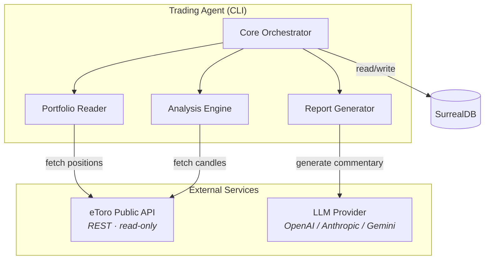
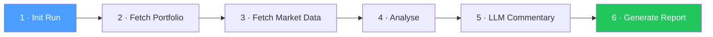

# eToro Trading Assistant

> [!WARNING]
> **🤖 This project is exclusively vibe coded.** Every line of code, every test, and every piece of documentation has been generated entirely by AI agents. There has been zero manual coding. Use at your own risk — and enjoy the vibes.

## Project Goals

The eToro Trading Assistant is a **Python-based advisory trading agent** that integrates with eToro's public API to help with investment decisions. It is designed to:

- **Run twice daily** at UK market open (08:00 GMT) and close (16:30 GMT)
- **Fetch market data** — historical OHLCV candles, closing prices, and bid/ask spreads for stocks, crypto, ETFs, and commodities
- **Sync portfolio state** — read current open positions and P&L from eToro (read-only, no trade execution)
- **Analyse price action** — detect trends, calculate technical indicators (RSI, SMA, EMA, MACD, Bollinger Bands), and identify key price levels
- **Provide sector context** — group instruments by asset class and evaluate sector-level momentum
- **Generate LLM commentary** — use an AI model to produce natural-language market summaries and actionable recommendations (buy / sell / hold / reduce / increase)
- **Produce a report** — output a structured markdown report to the terminal and to file

> **Important:** This agent is strictly **read-only**. It never opens, closes, or modifies trades. It only provides advisory reports.

## Architecture



### Pipeline Flow



Each invocation of the agent walks through the pipeline above. Data is persisted to SurrealDB at every stage so that historical runs can be queried later.

### Component Responsibilities

| Component | Purpose |
|---|---|
| **Core Orchestrator** | Runs the pipeline end-to-end; CLI entry point |
| **eToro API Client** | Authenticated HTTP client with retry logic (read-only) |
| **SurrealDB Client** | Data access layer for all persistence |
| **Analysis Engine** | Price-action indicators, trend detection, sector grouping |
| **Portfolio Reader** | Fetches current portfolio state and P&L from eToro |
| **Report Generator** | Assembles report with LLM-generated commentary |

## Project Structure

```
src/agent/
├── orchestrator.py        # Pipeline coordinator
├── config.py              # Pydantic settings from .env
├── types.py               # Shared type definitions
├── etoro/                 # eToro API client layer
│   ├── client.py          #   HTTP client, auth, retry
│   ├── market_data.py     #   Instrument search, OHLCV, prices
│   ├── portfolio.py       #   Portfolio retrieval
│   └── models.py          #   Pydantic response models
├── db/                    # SurrealDB data access layer
│   ├── connection.py      #   DB connection lifecycle
│   ├── schema.py          #   Schema initialisation
│   ├── instruments.py     #   Instrument CRUD
│   ├── candles.py         #   OHLCV storage/retrieval
│   ├── snapshots.py       #   Portfolio snapshots
│   └── reports.py         #   Report & recommendation storage
├── analysis/              # Price action & sector analysis
│   ├── price_action.py    #   Trend detection, key levels
│   ├── sector.py          #   Sector context & rotation
│   ├── indicators/        #   Technical indicator library
│   └── types.py           #   Analysis result types
├── reporting/             # Report generation
│   ├── generator.py       #   Assemble report from analyses
│   ├── llm.py             #   LLM client for commentary
│   └── formatter.py       #   Markdown & terminal rendering
└── utils/                 # Shared utilities
    └── __init__.py        #   Structured logging
```

## Tech Stack

| Technology | Role |
|---|---|
| **Python 3.11+** | Application language |
| **httpx** | Synchronous HTTP client for eToro API |
| **SurrealDB** | Persistence — market data, portfolio snapshots, reports |
| **Pydantic** | Data validation and settings management |
| **pandas** | Data manipulation for analysis |
| **structlog** | Structured JSON logging |
| **OpenAI / Anthropic / Gemini** | LLM API for market commentary |
| **Rich** | Terminal output formatting |
| **pytest** | Testing framework |

## Getting Started

### Prerequisites

- Python 3.11 or higher
- Docker (for local SurrealDB)
- An eToro API key (Read permissions only)
- An LLM API key (OpenAI, Anthropic, or Gemini)

### Setup

```bash
# 1. Clone the repository
git clone https://github.com/oliverwest9/etorro-trading-assistant.git
cd etorro-trading-assistant

# 2. Create and activate a virtual environment
python -m venv .venv
source .venv/bin/activate      # Unix/macOS
# .venv\Scripts\activate       # Windows

# 3. Install dependencies
pip install -e ".[dev]"

# 4. Configure environment variables
cp .env.example .env
# Edit .env with your actual API keys and DB credentials

# 5. Start SurrealDB
docker-compose up -d
```

### Running Tests

```bash
pytest                        # All tests (unit + integration)
pytest -m "not integration"   # Unit tests only
pytest -m integration         # Integration / E2E tests only
pytest -v                     # Verbose output
```

## License

This project is for personal/educational use.
